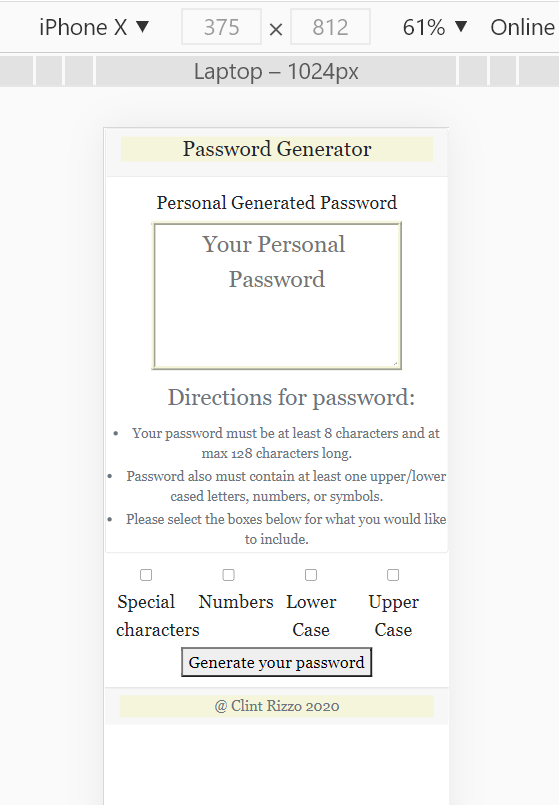

# hw3-password-generator

# languages used:
    1. HTML
       1. Bootstrap was used for the extension box and the click boxes
    2. CSS
    3. Javascript

#Project
1. Index.html
   1. The Html file was mainly created using bootstrap with a little tweaks to the actual code. Main tweaks were changing the class names so I could style that practicular area.
   2. When the page is launched you wont see much till you click the generate password button.
      1. Please read the directions or the password won't be generated for the user.
      2. For longer passwords you can extend the text area to copy the password or to see the full password.
2. CSS File
   1. Css file is where I added padding and floats to make the page a little more organized when shown on a phone.
3. Javascript file
   1. This file was a little difficult to start but after researching and looking at some files from school I was able to break it down. I called the variables from the HTML file by using the get element by id.
      1. I set the password min and max lengths as a variable as well
   2. Functions
      1. I set my functions and listed them into strings
      2. For the check boxes I created functions and added the checked at the end of the called element so the user has the choice on selecting what they would like in their password.
   3. If statements
      1. The first set of if statements that are shown, I set prompts in case the user goes below the minumum or goes above the maximum
      2. Next if statement is to have the password be ran if the lengths are met
      3. final if statments I used the math random function to get a random letter, number, or symbol from that functions string.
   4. passwordBox
      1. For the final part of the code I pulled the passwordBox from the text area portion of the HTML and made the value equal to my variable "password". If all the criteria was met then a password is generated into the text area.
      2. I tested the button and check boxes by console logging to see if any errors would occur. When they did occur I would research the error codes to help me along the way. Most of the errors came from capitalization and brackets in the wrong area. 

# Sources:
1. [operators](https://www.w3schools.com/js/js_comparisons.asp) 
2. [checkbox](https://www.w3schools.com/jsrefprop_checkbox_checkedasp)
3. [mathrandom](https://developer.mozilla.org/en-US/docs/Web/JavaScript/Reference/Global_Objects/Math/random)
4. [var](https://codeburst.io/difference-between-var-let-and-const-in-javascript-fbce2fba7b4)
5. [if-statements](https://www.w3schools.com/jsref/jsref_if.asp)

# testing site for different phones and tablet
1. [emulator](http://www.viewportemulator.com/)
   1. [amazon-kindle](http://www.viewportemulator.com/devices/amazon/kindle-fire-hdx-8.9-3rd-generation/?url=https%3A%2F%2Fclintrizzo.github.io%2Fhw3-password-generator%2F&orientation=landscape) 
   2. 
      1. I used this screen when I clicked F12 and went to sources

# link to active page
[password](https://clintrizzo.github.io/hw3-password-generator/.)

